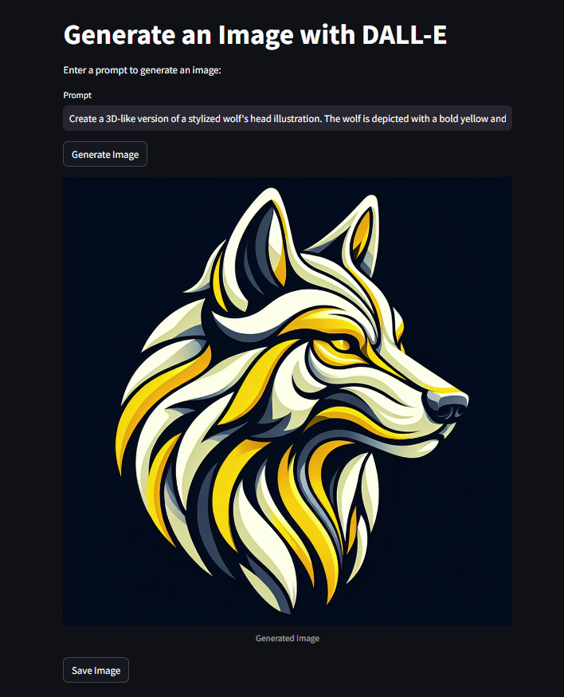

# DALL-E Image Generation Using Streamlit

This application allows authenticated users to generate images using OpenAI's DALL-E model based on the provided prompt. The app includes an admin panel to view request logs and search functionality.

## Demo Image


## Features
- User authentication
- Generate images using OpenAI's DALL-E model
- Admin panel to view and search request logs
- Save generated images

## Installation

### Prerequisites
- Python 3.7 or higher
- An OpenAI API key

### Setup

1. Clone the repository:
    ```bash
    git clone https://github.com/SyedAffan10/DALL-E-Image-Generation-Using-Streamlit.git
    cd DALL-E-Image-Generation-Using-Streamlit
    ```

2. Create and activate a virtual environment:
    ```bash
    python -m venv venv
    source venv/bin/activate  # On Windows, use `venv\Scripts\activate`
    ```

3. Install the required packages:
    ```bash
    pip install -r requirements.txt
    ```

4. Create a `.env` file in the root directory and add your OpenAI API key:
    ```env
    OPENAI_API_KEY=your_openai_api_key
    ```

## Usage

1. Run the Streamlit app:
    ```bash
    streamlit run app.py
    ```

2. Open your web browser and go to `http://localhost:8501`.

3. Log in with the following credentials:

   - Username: `affan`
   - Password: `affan`

   - Username: `sohail`
   - Password: `sohail`

   - Username: `admin`
   - Password: `admin`

4. As a regular user, you can enter a prompt to generate an image. As an admin, you can view and search the request log.
